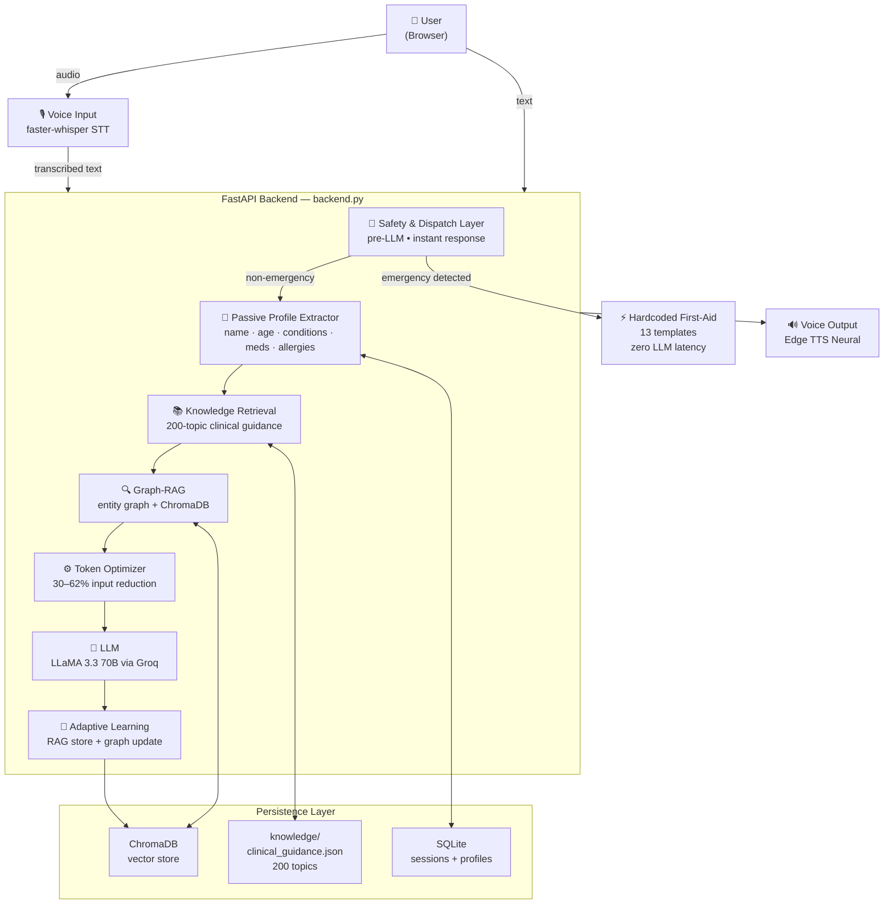
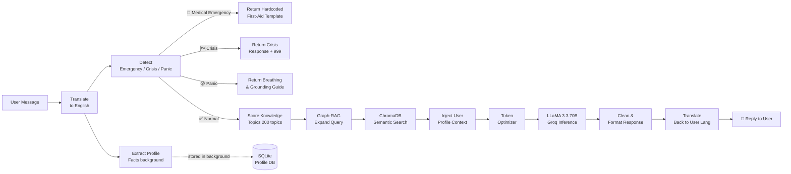
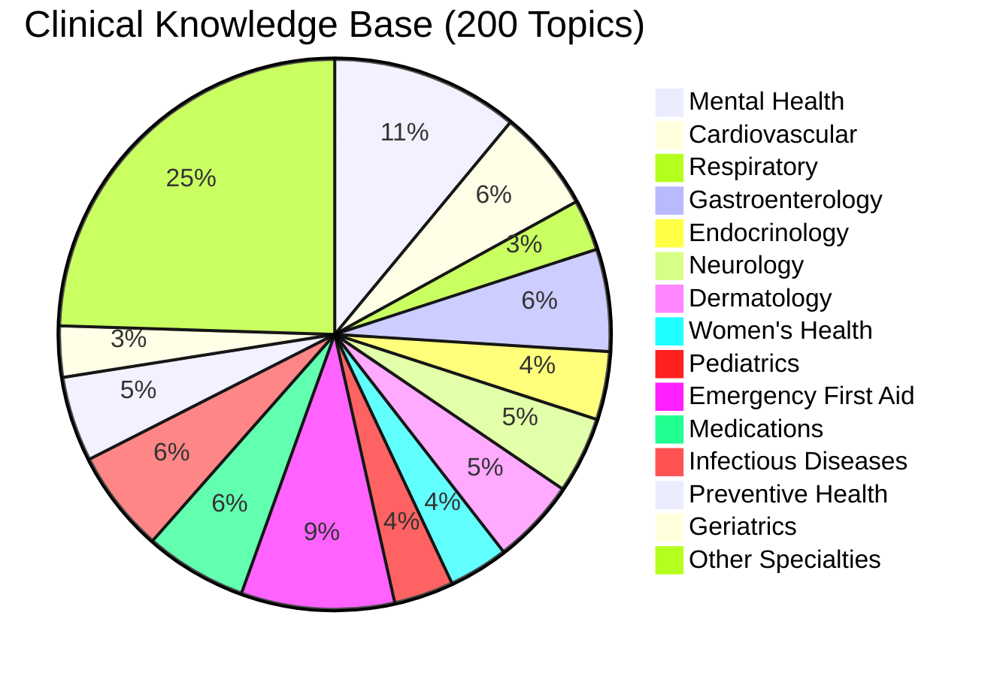
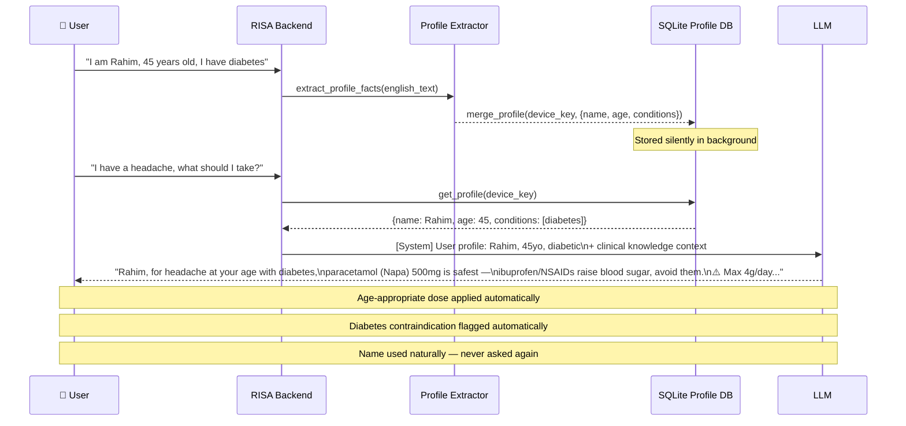
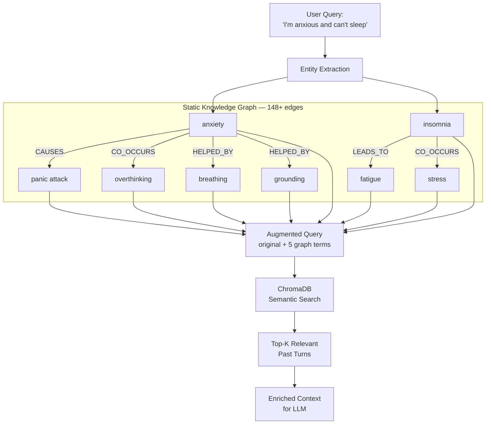
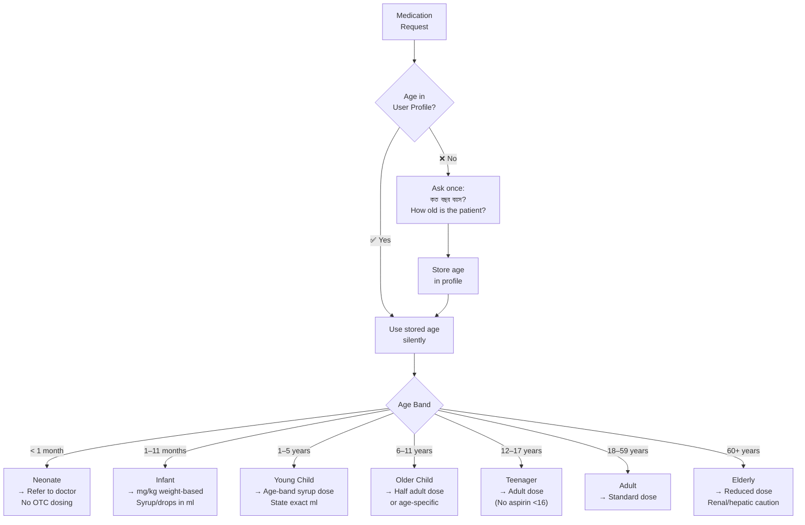
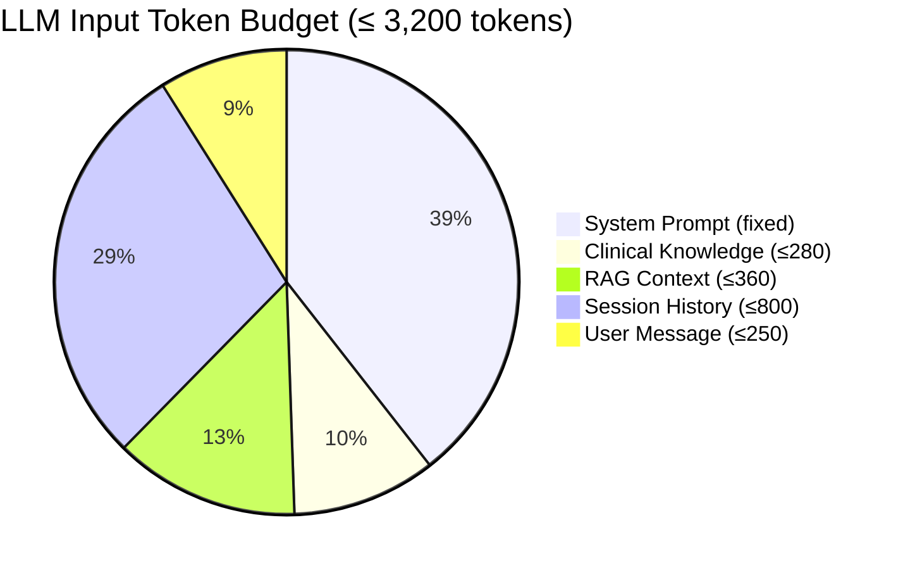
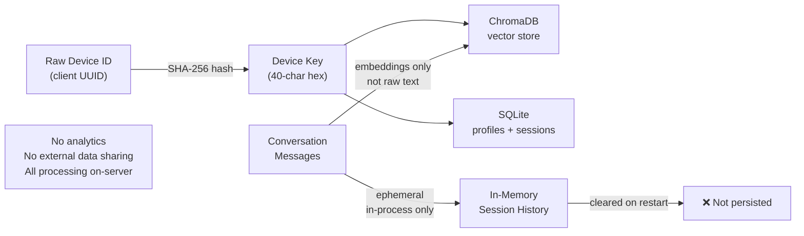
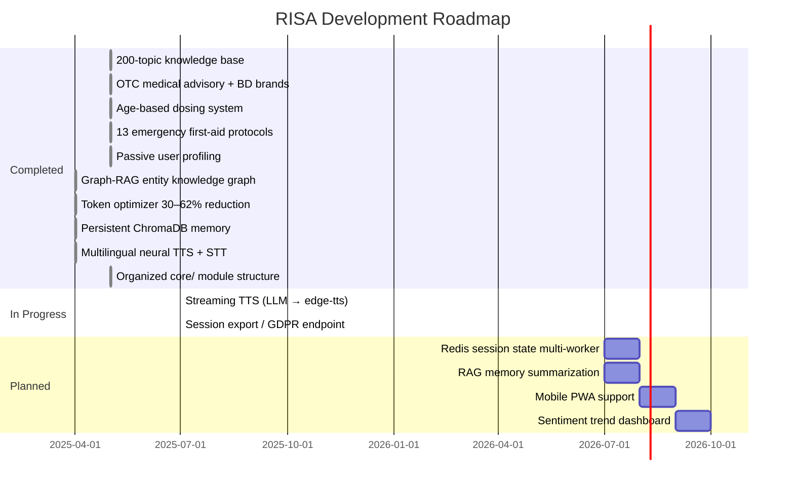

<div align="center">


# RISA — AI Health & Mental Wellness Companion

**Responsive Intelligent Support Assistant**

*Medical Advisory · Emergency First Aid · Mental Health · Multilingual · Personalized · Graph-RAG Powered*

[](https://python.org)
[](https://fastapi.tiangolo.com)
[](https://langchain.com)
[](https://groq.com)
[](https://trychroma.com)
[](LICENSE)

<br/>

> **RISA is a production-ready, open-source AI health companion** — combining a 200-topic clinical knowledge base, full medical advisory with Bangladesh-specific drug brands and dosing, hardcoded emergency first-aid protocols, persistent Graph-RAG memory, passive user profiling, multilingual voice I/O, and mental health support — all on a completely free stack.

<br/>

[**Quick Start**](#quick-start) · [**Features**](#key-features) · [**Architecture**](#architecture) · [**API Reference**](#api-reference) · [**Contributing**](#contributing)

---

</div>

## What is RISA?

RISA (Responsive Intelligent Support Assistant) is an **open-source AI health and wellness companion** that acts like a knowledgeable doctor-friend. It provides:

- **Full medical advice** — symptoms → diagnosis → treatment plan → medication with correct dose for the patient's age
- **OTC medication guidance** — specific Bangladesh brand names, dosing by age group, serious side effects, prices in BDT
- **Emergency first-aid protocols** — CPR, choking, severe bleeding, anaphylaxis, stroke, seizure, drowning — hardcoded for maximum speed, no LLM latency
- **Mental health support** — anxiety, depression, trauma, burnout, crisis detection, panic support
- **Personalized care** — passively learns the user's name, age, conditions, allergies, and medications from conversation; applies them silently to every response

> **Clinical Disclaimer:** RISA is not a substitute for professional medical or mental health care. It does not replace licensed doctors or therapists. In emergencies, it directs users to local emergency services (Bangladesh: **999**).

---

## Key Features

### 🏥 Medical Advisory
- **200-topic clinical knowledge base** covering mental health, cardiology, respiratory, GI, endocrine, neurology, dermatology, women's health, pediatrics, geriatrics, infectious diseases, preventive health, and more
- **OTC medication recommendations** with generic + Bangladesh brand names (Napa, Brufen, Zetid, Alatrol, Seclo, etc.)
- **Age-based dosing** — asks for age once, applies correct infant/child/adult/elderly dose automatically; never asks again once known
- **BDT price guidance** when requested — approximate retail prices per strip/bottle from Bangladesh pharmacies
- **Serious side effect warnings** — every recommendation includes a `⚠️ Watch out for:` line covering critical risks
- **Drug interaction and contraindication checking** against the user's known medications and conditions

### 🚨 Emergency First Aid
Hardcoded response templates (bypass LLM entirely for speed) for 13 emergency types:

| Emergency | Key Protocol |
|---|---|
| Cardiac arrest / CPR | 100–120 compressions/min, 5–6cm depth, hands-only valid |
| Choking (adult) | 5 back blows + 5 Heimlich, alternate until cleared |
| Choking (infant <1yr) | Back blows + chest thrusts only — NO Heimlich |
| Severe bleeding | Direct pressure 10 min, tourniquet 5–7cm above wound |
| Anaphylaxis | EpiPen outer thigh, 10s hold, second dose at 5–15 min |
| Stroke (FAST) | Note exact onset time — 4.5-hour thrombolysis window |
| Seizure | Time it, protect, no restraint, no finger in mouth |
| Drowning | 5 rescue breaths FIRST (hypoxia priority) |
| Poisoning | No vomiting induction, collect packaging |
| Heat stroke | Ice packs to neck/armpits/groin + fan + evaporative cooling |
| Electric shock | Cut power first, do NOT touch victim |
| Burns | 10+ min cool running water, cling film, not ice/butter |
| Recovery position | 5-step technique for unconscious breathing person |

### 👤 Passive User Profiling
RISA silently learns and stores personal facts from what users naturally share — **never by asking directly**:

| Fact | Example trigger |
|---|---|
| Name | "My name is Rahim" / "I am Fatema," |
| Age | "I am 35 years old" / "I am 45" |
| Gender | "I am a woman / father / wife…" |
| Weight | "I weigh 65kg" / "weighing 58kg" |
| Blood group | "My blood group is O+" |
| Conditions | "I have diabetes / hypertension / asthma…" |
| Allergies | "I am allergic to penicillin" |
| Medications | "I take metformin / on lisinopril" |
| Location | Any Bangladesh city/district mentioned |

Once learned, this profile is injected into every LLM call — enabling correct age-based dosing, allergy conflict checking, and personalized condition-specific advice.

### 🧠 Mental Health Support
- **38-language support** with neural voice I/O
- Real-time **crisis pattern detection** (suicidal ideation, self-harm) in English and Bengali
- **Panic attack support mode** — guided 4-2-6 breathing, 5-4-3-2-1 grounding
- **Emotion detection** — anxiety, depression, anger, grief, burnout, trauma, loneliness
- **Muslim cultural alignment** — spiritually sensitive framing (sabr, dua, dhikr) where appropriate
- **Bangladesh crisis resources** — Kaan Pete Roi: 01779-554391, NIMH: 9676001

### 🔍 Graph-RAG Memory
- **Entity knowledge graph** (35 nodes, 148+ edges) — expands every query to surface related context
- **Per-device ChromaDB** — cross-session semantic memory using local ONNX embeddings (zero cost)
- **Dynamic device graph** — learns user's recurring themes, injects top patterns into every prompt
- **Token Optimizer** — automatically trims LLM input by 30–62% per request

### ⚡ Performance
- **Streaming SSE** — real-time sentence-by-sentence delivery via `/chat/stream`
- **Fire-and-forget** — RAG writes and profile extraction never block the response
- **Translation cache** — 24-hour TTL for language detection and translation
- **Emergency bypass** — first-aid responses skip the LLM entirely for maximum speed

---

## Architecture

### System Overview



---

### Request Processing Pipeline



---

### Knowledge Base Coverage — 200 Topics



---

### User Profile Lifecycle



---

### Graph-RAG Query Expansion



---

### Age-Based Dosing Logic



---

### Token Budget Optimization



```
Before optimization (heavy session):     After optimization:
─────────────────────────────────────    ────────────────────
System prompt      ~1,100 tokens    →    ~1,100  (untouched)
Knowledge context    ~655 tokens    →      ~267  (capped)
RAG context          ~260 tokens    →      ~260  (within budget)
Session history    ~3,660 tokens    →      ~732  (smart-trimmed)
─────────────────────────────────────    ────────────────────
Total:             ~5,675 tokens    →    ~2,359  (58% reduction)
```

---

## Tech Stack

| Layer | Technology | Notes |
|---|---|---|
| **Framework** | FastAPI + Uvicorn | Async, production-ready ASGI |
| **LLM** | LLaMA 3.3 70B via Groq | Sub-second inference, free tier |
| **Vector RAG** | ChromaDB + ONNX all-MiniLM-L6-v2 | Local embeddings, zero cost |
| **Graph RAG** | NetworkX + custom engine (`core/graph_rag.py`) | 35 entity nodes, 148+ knowledge edges |
| **Token Optimizer** | `core/token_optimizer.py` (custom) | 30–62% input reduction |
| **User Profiles** | SQLite via `core/user_profile_store.py` | Passive extraction, per-device |
| **Sessions** | SQLite via `core/session_store.py` | ChatGPT-style persistent sessions |
| **TTS** | Microsoft Edge TTS (`edge-tts`) | Free, 40+ neural voices |
| **STT** | faster-whisper (local) | No API key, no rate limits |
| **Translation** | deep-translator | Free, 38+ languages |
| **LangChain** | langchain + langchain-groq | LLM orchestration |
| **Frontend** | Vanilla HTML/CSS/JS | No framework, zero build step |

---

## Project Structure

```
risa/
├── backend.py              # FastAPI app — all endpoints, LLM, TTS, STT, RAG orchestration
├── settings.py             # Environment config (HOST, PORT, ALLOW_ORIGINS)
├── index.html              # Single-page frontend
├── requirements.txt
├── Makefile
│
├── core/                   # Python support modules
│   ├── __init__.py
│   ├── graph_rag.py        # Graph-RAG engine — entity graph, query expansion, device profile
│   ├── token_optimizer.py  # Token budget optimizer — 30–62% input reduction
│   ├── session_store.py    # SQLite-backed chat session persistence
│   └── user_profile_store.py  # Passive user profiling — extraction, storage, context injection
│
├── knowledge/
│   ├── clinical_guidance.json   # 200-topic evidence-based knowledge base
│   └── learned_guidance.json    # Auto-generated from conversations (gitignored)
│
├── assets/
│   ├── css/                # Styles + Material Icons font
│   ├── js/                 # Frontend logic, jQuery, runtime config
│   ├── svg/                # Logo and icons
│   └── audio/              # UI sound effects
│
├── scripts/
│   ├── generate_token.py   # Generate secure LEARNED_GUIDANCE_ADMIN_TOKEN
│   └── setup_venv.sh       # Virtual environment setup
│
├── risa_mcp/               # Model Context Protocol server
│   ├── __init__.py
│   └── server.py
│
└── chroma_db/              # Runtime data — ChromaDB vectors + SQLite (gitignored)
```

---

## Quick Start

### Prerequisites

- Python 3.11+
- `ffmpeg` in PATH (for audio transcription)
- A free [Groq API key](https://console.groq.com)

### 1. Clone & Install

```bash
git clone https://github.com/your-org/risa.git
cd risa

python -m venv .venv
source .venv/bin/activate   # Windows: .venv\Scripts\activate

pip install -r requirements.txt
```

### 2. Configure

```bash
cp .env.example .env
# Edit .env — only required key:
#   GROQ_API_KEY=gsk_...
```

> TTS, STT, embeddings, Graph-RAG, and user profiling all run locally — no extra API keys needed.

### 3. Run

```bash
python backend.py
# or
uvicorn backend:app --reload --host 0.0.0.0 --port 8000
```

Open **http://localhost:8000** — RISA is ready.

### Docker

```bash
docker compose up -d --build
```

---

## Configuration

| Variable | Required | Default | Description |
|---|---|---|---|
| `GROQ_API_KEY` | **Yes** | — | Groq API key for LLaMA 3.3 70B |
| `HOST` | No | `0.0.0.0` | Server bind address |
| `PORT` | No | `8000` | Server port |
| `ALLOW_ORIGINS` | No | `*` | CORS allowed origins (comma-separated) |
| `LEARNED_GUIDANCE_ADMIN_TOKEN` | No | — | Admin token for `/learned-topics` endpoint |
| `ENABLE_PREWARM` | No | `false` | Background warmup for embeddings, graph, Whisper |

Generate an admin token:
```bash
python scripts/generate_token.py
```

---

## Clinical Knowledge Base

200 topics organized across these domains:

| Domain | Count | Example Topics |
|---|---|---|
| Mental Health | 22 | anxiety, depression, PTSD, bipolar, ADHD, OCD, phobias, personality disorders |
| Emergency First Aid | 18 | CPR, choking (adult + infant), anaphylaxis, stroke, seizure, burns, drowning |
| Medications | 12 | antidepressants, antihypertensives, diabetes meds, mental health medications |
| Infectious Diseases | 12 | dengue, typhoid, malaria, HIV, STIs, sepsis, hepatitis B/C, worms |
| Gastroenterology | 12 | GERD, IBS, peptic ulcer, celiac, hepatitis, hemorrhoids, constipation |
| Cardiovascular | 12 | hypertension, heart failure, atrial fibrillation, DVT, PAD, Raynaud's |
| Preventive Health | 10 | screening schedules, adult vaccinations, cancer screening, travel health |
| Dermatology | 10 | acne, psoriasis, eczema, fungal infections, vitiligo, melasma |
| Neurology | 9 | migraine, epilepsy, Parkinson's, MS, Bell's palsy, dementia, memory |
| Endocrinology | 8 | type 1 & 2 diabetes, gestational diabetes, hypothyroidism, PCOS, gout |
| Women's Health | 7 | pregnancy, menopause, endometriosis, PMDD, miscarriage, contraception |
| Pediatrics | 7 | childhood vaccinations, fever management, autism, infant feeding |
| Respiratory | 6 | asthma, COPD, pneumonia, sleep apnea, TB, COVID-19 |
| Geriatrics | 6 | falls prevention, dementia care, polypharmacy, palliative care |
| Other Specialties | 49 | urology, ophthalmology, ENT, rheumatology, sexual health, nutrition, occupational health… |

---

## API Reference

### `POST /chat`
Standard chat. Returns full formatted HTML response.

```json
// Request
{
  "message": "I have a fever, what should I take?",
  "device_id": "uuid-v4-string",
  "skip_translation": false,
  "source_lang": "en"
}

// Response
{
  "reply": "<p>...</p>",
  "detectedLang": "en",
  "translatedQuery": "",
  "knowledgeUsed": ["fever-infection", "otc-pain-fever-meds"],
  "performanceMs": 1240
}
```

### `POST /chat/stream`
SSE streaming — sentences arrive in real-time as the LLM generates them.

```javascript
// Each SSE event: { t: "sentence text", lang: "en" }
// Final event:    { done: true, html: "...", lang: "en", ms: 1240 }
```

### `POST /tts`
Neural text-to-speech → streams MP3.
```json
{ "text": "Take paracetamol 500mg with water.", "lang": "bn-BD" }
```

### `POST /transcribe`
Local speech-to-text via faster-whisper.
```
multipart/form-data: file=<audio>, lang="bn"
→ { "text": "transcribed text", "lang": "bn" }
```

### `GET /health`
```json
{ "status": "ok", "app": "RISA" }
```

### `GET /stats`
```json
{
  "app": "RISA",
  "rag_documents": 412,
  "graph_rag": { "ready": true, "nodes": 35, "edges": 162 },
  "model": "llama-3.3-70b-versatile",
  "learned_topics": 24
}
```

### `POST /clear`
Clear in-memory session history for a device.

---

## Supported Languages

| Language | TTS Voice | STT Engine |
|---|---|---|
| Bengali (BD) | bn-BD-NabanitaNeural | faster-whisper ✦ |
| Bengali (IN) | bn-IN-TanishaaNeural | faster-whisper ✦ |
| English | en-US-JennyNeural | Web Speech API |
| Hindi | hi-IN-SwaraNeural | faster-whisper ✦ |
| Arabic | ar-SA-ZariyahNeural | faster-whisper ✦ |
| Urdu | ur-PK-UzmaNeural | faster-whisper ✦ |
| French | fr-FR-DeniseNeural | Web Speech API |
| Spanish | es-ES-ElviraNeural | Web Speech API |
| German | de-DE-KatjaNeural | Web Speech API |
| Chinese | zh-CN-XiaoxiaoNeural | faster-whisper ✦ |
| Japanese | ja-JP-NanamiNeural | faster-whisper ✦ |
| + 27 more | (see `_EDGE_VOICES` in backend.py) | — |

> **✦** faster-whisper provides superior accuracy for these languages vs browser Web Speech API.

---

## Deployment

### Railway
Set `GROQ_API_KEY` in Railway environment variables. The `Procfile` handles the rest.

```bash
# Update assets/js/config.js with your Railway URL before deploying:
# const defaultRemote = 'https://your-app.up.railway.app';
```

### Docker
```bash
docker build -t risa .
docker run -p 8000:8000 -e GROQ_API_KEY=gsk_... risa
```

### Manual (VPS)
```bash
export GROQ_API_KEY=gsk_...
uvicorn backend:app --host 0.0.0.0 --port 8000 --workers 1
```
> Use `--workers 1` — in-memory session state is not shared across workers.

---

## Security & Privacy



- **Device IDs are SHA-256 hashed** — raw identifiers never persisted
- **User profiles stored locally** in SQLite — never sent to any external service
- **Conversation memory is ephemeral** — only semantic embeddings persist, not raw messages
- **No third-party analytics** — fully self-contained
- **Admin endpoints** require `LEARNED_GUIDANCE_ADMIN_TOKEN`
- **CORS** configurable via `ALLOW_ORIGINS` — restrict in production

---

## Roadmap



---

## Contributing

Contributions welcome — clinical guidance improvements, new language support, UI enhancements, and bug fixes.

```bash
git checkout -b feature/your-feature
# make changes
python -m py_compile backend.py core/*.py
git commit -m "feat: description"
# open PR
```

**Priority areas:**
- Expanding `knowledge/clinical_guidance.json` with more topics
- Adding more conditions/medications to `core/user_profile_store.py` extraction patterns
- Mobile PWA support
- Unit tests for crisis detection and RAG retrieval
- Redis-backed session state for multi-worker deployments

---

## License

MIT License — free to use, modify, and deploy. Please maintain the clinical disclaimer and do not present RISA as a replacement for professional medical or mental health services.

---

<div align="center">

**Built for accessible healthcare and mental wellness worldwide.**

</div>
